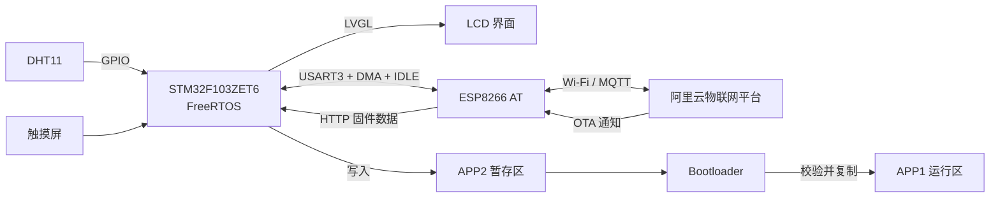

# 基于 STM32F103 + FreeRTOS + LVGL 的物联网环境监测终端

本项目以 **STM32F103ZET6** 为主控，结合 **FreeRTOS、LVGL、ESP8266 和阿里云物联网平台**，实现温湿度采集、本地人机界面、MQTT 数据上报、远程阈值设置、云端校时及双分区 OTA 升级。

## 功能特性

- 基于 FreeRTOS 实现传感器采集、LVGL 刷新、MQTT 上报、串口接收、按键扫描和看门狗监控等任务。
- 使用 DHT11 采集温湿度，在 LCD 上实时显示温度、湿度、温度阈值、时间、联网状态和报警状态。
- 通过 ESP8266 AT 固件连接阿里云物联网平台，支持设备属性上报和温度阈值远程下发。
- USART3 使用 DMA 循环接收与 IDLE 空闲中断，处理缓冲区回绕和分段数据。
- 支持阿里云 MQTT NTP 校时：MQTT 首次连接成功后自动校时，也可通过界面按钮手动发起校时。
- 支持远程 OTA：解析升级通知、HTTP 下载固件、写入 APP2、MD5 校验、设置升级标志并复位。
- Bootloader 校验应用向量表，将 APP2 固件复制到 APP1；升级标志在复制成功后清除，复制阶段掉电后可重试。
- 使用通信互斥锁和 OTA 状态控制，下载期间暂停传感器数据上报，避免 AT 指令混入固件数据流。
- 使用独立看门狗与多任务心跳监控，任一关键任务长时间未运行时停止喂狗并触发系统复位。

## 硬件与软件环境

| 项目 | 配置 |
| --- | --- |
| MCU | STM32F103ZET6，Cortex-M3，512 KB Flash，64 KB SRAM |
| 主频 | 72 MHz |
| RTOS | FreeRTOS |
| GUI | LVGL |
| 显示与输入 | 2.8 英寸 LCD + 触摸屏 |
| 温湿度传感器 | DHT11 |
| Wi-Fi 模块 | ESP8266（AT 固件） |
| 云平台 | 阿里云物联网平台 |
| 开发工具 | STM32CubeMX、Keil MDK-ARM |
| 调试接口 | SWD、串口日志 |

## 系统架构

## FreeRTOS 任务设计

| 任务 | 主要职责 |
| --- | --- |
| ESP8266 接收任务 | 解析 MQTT 消息、连接状态、OTA 通知和 NTP 响应 |
| 数据上报任务 | 周期上报温湿度属性；OTA 期间暂停发送 |
| DHT11 任务 | 周期采集温湿度并更新业务数据 |
| LVGL 任务 | 执行界面刷新和控件状态更新 |
| 按键任务 | 扫描本地按键输入 |
| 看门狗任务 | 检查关键任务心跳并决定是否喂狗 |

任务之间使用信号量通知数据到达，使用互斥锁保护 ESP8266 串口发送和 OTA 独占通信过程；短时间共享数据访问使用临界区保护。

## MQTT 与云端功能

项目使用的主要 Topic 如下，其中 `${ProductKey}` 和 `${DeviceName}` 需要替换为实际设备信息。

| 功能 | Topic |
| --- | --- |
| 属性上报 | `/sys/${ProductKey}/${DeviceName}/thing/event/property/post` |
| 属性设置 | `/sys/${ProductKey}/${DeviceName}/thing/service/property/set` |
| 固件版本上报 | `/ota/device/inform/${ProductKey}/${DeviceName}` |
| OTA 升级通知 | `/ota/device/upgrade/${ProductKey}/${DeviceName}` |
| NTP 请求 | `/ext/ntp/${ProductKey}/${DeviceName}/request` |
| NTP 响应 | `/ext/ntp/${ProductKey}/${DeviceName}/response` |

物模型属性标识符区分大小写，当前程序使用：

| 标识符 | 含义 | 方向 |
| --- | --- | --- |
| `temperature` | 当前温度 | 设备上报 |
| `Humidity` | 当前湿度 | 设备上报 |
| `TempThreshold` | 温度报警阈值 | 云端下发 |

## OTA 升级设计

### Flash 分区

| 区域 | 起始地址 | 大小 | 用途 |
| --- | ---: | ---: | --- |
| Bootloader | `0x08000000` | `0x7800`（30 KB） | 启动、升级复制和 APP 跳转 |
| APP1 | `0x08007800` | `0x3C000`（240 KB） | 当前运行固件 |
| APP2 | `0x08043800` | `0x3C000`（240 KB） | OTA 新固件暂存区 |
| OTA Flag | `0x0807F800` | 2 KB 页 | 保存升级标志 |

APP 固件必须按照 **APP1 地址 `0x08007800`** 链接。APP2 只是下载暂存区，Bootloader 会把固件复制到 APP1 后再运行，不能将 OTA 固件链接到 APP2 地址。
